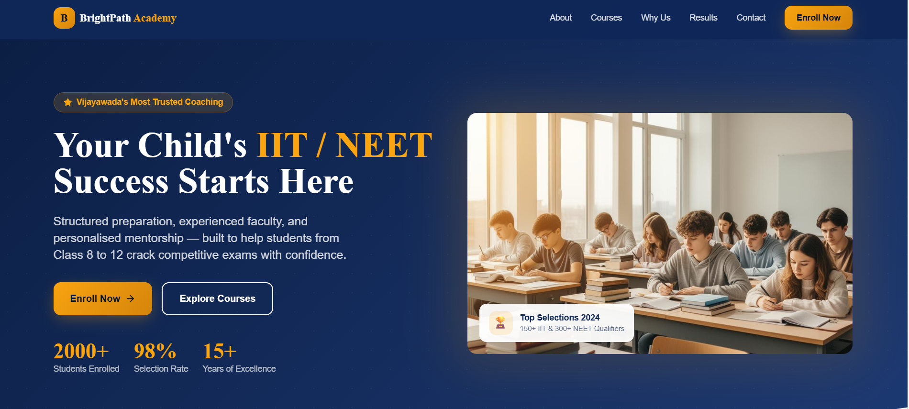

# Task 1 - Website Copy Generator

## Description
This task focuses on generating high-quality website content using prompt engineering techniques.

## Tools Used
- ChatGPT
- Lovable AI

## Prompt
Generate high-converting website content for a coaching institute in Vijayawada offering IIT-JEE and NEET courses, including homepage, services, and CTA.

## Output
- Homepage content  
- Services section  
- Call-to-action
## Screenshots

## Learnings
- Writing effective prompts  
- Understanding AI-generated content  
- Improving output quality
